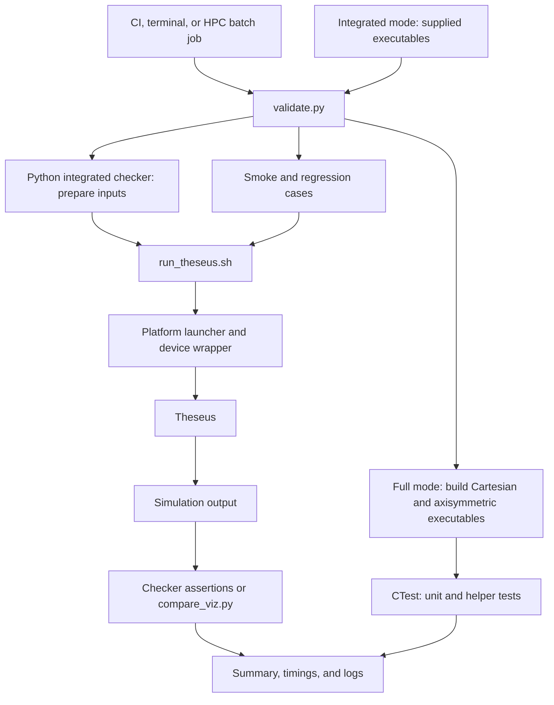

# Running tests

Use `scripts/validate.py` to run the test suite and collect its results.
Choose a mode based on whether you need fresh CPU builds or want to test executables
that you have already built.

| Task | Mode | What runs |
| --- | --- | --- |
| Run the same suite as Quick/Nightly CI | Default (`full`) | Fresh CPU builds, unit tests, integrated tests, smoke runs and regression comparisons |
| Test prepared CPU or CUDA builds | `--suite integrated` | Integrated tests, smoke runs and regression comparisons |
| Check a completed full run against your checkout | `check` | Result, log and source checks; no simulations |

For test coverage and tolerances, see the [test inventory](verification.md).
For registration and checker examples, see [Adding tests](adding-tests.md).

## How the pieces fit together



CI workflows provision the environment, invoke this runner and publish results.
Add individual tests through the [test registration paths](adding-tests.md), not
as extra workflow steps.

The runner selects tests and records results. Python checkers prepare inputs and
check the simulation output. `run_theseus.sh` selects the platform launcher and
sets up device execution. Each integrated check has one entry in the suite.

## Run the full suite locally

You need Python 3.9 or later, Git, Bash, CMake/CTest, MPI compilers, and installed
MFEM/PLATO dependencies. Install the Python packages listed in
`ci-resources/requirements-ci.txt` into your test environment.

From the repository root:

```bash
export CC=mpicc CXX=mpicxx
python3 scripts/validate.py run \
  --prefix /path/to/tpl/install \
  --python /path/to/test-environment/bin/python \
  --results ../validation/run-001 --jobs 4
```

Choose a **new results directory outside the checkout**. The runner copies the
source into that directory and builds Cartesian and axisymmetric Debug executables
with PLATO, subcell blending and `NO_OPT`. `--jobs` controls build parallelism.

`run` waits for completion and returns a nonzero exit status if a required check
fails. For an unattended workstation run, replace `run` with `start`; it returns
the worker PID and the summary path while testing continues in the background.
The machine must remain running.

## Integrated tests with prepared builds (HPC or workstation)

Prepare two builds of the revision you want to test:

| Build | Required settings and targets |
| --- | --- |
| Cartesian | `AXISYMMETRIC=OFF`, PLATO; `theseus` and `table_lookup_tests` |
| Axisymmetric | `AXISYMMETRIC=ON`, PLATO; `theseus` |

For CUDA, both builds need `ENABLE_CUDA=ON` and compatible device-enabled dependencies.
The visualization and CFL checkers use `table_lookup_tests` for host EOS reference
calculations. The CFL checker also requires the AIR11 PLATO database.
Use the compiler/MPI environment associated with your builds and a Python environment
containing the CI requirements.

Run this command inside your HPC allocation, or directly for prepared local builds:

```bash
python3 scripts/validate.py run --suite integrated \
  --build-standard /path/to/build-gpu \
  --build-axisymmetric /path/to/build-axis-gpu \
  --device cuda --prefix /path/to/tpl/install \
  --python /path/to/test-environment/bin/python \
  --results /path/to/scratch/validation-run-001
```

Use `--device cpu` for CPU execution. The suite includes one- and two-rank cases;
allocate resources for two MPI ranks and the requested devices. It uses the supplied
executables without rebuilding them. Rebuild after source changes before submitting
another development test.

In a batch script, keep your site's working resource directives, module setup and
Python environment, then invoke the command above. Use foreground `run` so the batch
job waits for testing and receives its exit status. Copy the results directory and
batch output to persistent storage when the job finishes.

### Platform launch selection

`run_theseus.sh` chooses the launch command from the hostname:

| Hostname pattern | Launch path |
| --- | --- |
| `gh*` | `srun` with `launch_delta_device.sh` |
| `front*`, `c[0-9]*-[0-9]*` | `ibrun` with `launch_frontera_device.sh` |
| `tuo*` | `flux run` |
| Other hosts | `mpiexec` from PATH |

The device scripts select visibility from the local MPI rank. The test checkers
pass the device and rank count to `run_theseus`; they do not select schedulers.

For the fallback MPI path, `--mpiexec /path/to/mpiexec` selects an executable and
repeated `--mpi-arg` options supply its arguments. For example, a local OpenMPI
installation may need:

```bash
--mpi-arg=--host --mpi-arg=localhost:4 \
--mpi-arg=--map-by --mpi-arg=slot:OVERSUBSCRIBE \
--mpi-arg=--bind-to --mpi-arg=none
```

These are local placement options, not HPC allocation settings. Without MPI overrides,
the runner leaves launcher selection to the harness.

## Read the results

Start with `summary.txt`. It updates as checks start and finish and lists each result,
elapsed time and log path. Integrated-check timings cover their simulation and assertion
work. Golden simulations and comparisons have separate timings.

| File or directory | Contents |
| --- | --- |
| `summary.txt` | Overall status and per-check results |
| `logs/` | Command lines, working directories and captured output |
| `integrated/` | Generated inputs, per-simulation logs and integrated-test output |
| `cases/` | Smoke, cyclic and golden simulation output |
| `references/` | Prepared golden data |
| `results.json` | Commands, exit codes, timestamps and log hashes |
| `manifest.json` | Source hashes, tool paths, build information and run options |
| `source/` | Source snapshot |
| `build-standard/`, `build-axisymmetric/` | Full-mode builds and CTest details |
| `launcher.log` | Background-worker startup output (`start` only) |

Quick and Nightly CI print the summary and upload test artifacts.

### Diagnose a failure

Open the first failing check's log. Its header gives the command and working directory
needed to reproduce it. Integrated-check logs point to the individual simulation logs.
Independent checks continue after a failure; checks that require a failed prerequisite
are marked `BLOCKED`. Both failures and blocked checks make the suite fail.

Determine whether the cause is launch/setup, input handling, or a numerical mismatch.
For numerical failures, compare the intended physical result with the measured output
before changing assertions, tolerances or reference data. After a fix, run the affected
check, then run the suite in a new results directory.

`--timeout SECONDS` sets the runner's per-command limit (default 3600 seconds).
Some Python checkers also enforce shorter per-simulation timeouts. An interrupted
or unfinished run does not establish a passing result.

## Check source correspondence

For a completed full run:

```bash
python3 scripts/validate.py check --results ../validation/run-001
```

This verifies that every required check passed, saved logs and the source snapshot
are intact, and the current implementation and tests match the tested source.
Documentation-only differences are reported separately.

The snapshot includes tracked and non-ignored untracked files. Keep generated output
outside the checkout or in ignored directories. Source symlinks and submodules are
not supported by the snapshot mechanism.

Prepared-build runs record executable and CMake-cache hashes and detect changes during
execution. Their results apply to those binaries; the runner cannot establish which
source produced an arbitrary supplied executable. `check` requires a full run and does
not accept integrated-only results. Keep binaries, dependencies and tool environments
unchanged during testing; rerun after changing them.
